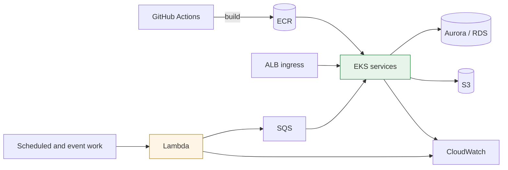

# AWS Production Operations

Operating backend services on AWS after the architecture diagram is finished: moving workloads between runtimes, making deployment targets explicit, limiting blast radius, and leaving enough evidence to diagnose the next incident.

These are anonymized case studies from production systems. Client names, repository names, account IDs, regions, cluster names, hostnames, and credentials are deliberately absent.

## What I owned

- container build and ECR delivery paths for Go and Python services
- EKS manifests, ALB ingress, namespaces, CronJobs, and rollout procedures
- Lambda deployments and the boundary between serverless and long-running workloads
- workload IAM for SQS, S3, and deployment automation
- Aurora/RDS connectivity, Redis resource tuning, and operational logging
- handover documents, rollback artifacts, and environment contracts

## Recurring shape

The point is not to put every service on Kubernetes. The point is to give each workload the runtime whose failure mode, duration, native dependencies, and scaling model fit it.

## Cases

| # | Case | Engineering question |
|---|---|---|
| 01 | [Operating services on EKS](cases/01-eks-service-operations.md) | How do you make the intended cluster, image, namespace, and rollout visible before deployment? |
| 02 | [Moving the runtime boundary](cases/02-hybrid-runtime-migration.md) | When should a Lambda workload move to EKS, and what should stay serverless? |
| 03 | [Observability and load hardening](cases/03-observability-and-load-hardening.md) | What changes after a load test or incident gives you evidence instead of guesses? |

## Principles

**The deployment target is input, not ambient state.** A shell's current AWS identity or Kubernetes context is not a safe source of truth. The target account and cluster must be checked and made visible before an image is pushed or a manifest is applied.

**A service boundary does not require a deployment boundary.** Related packages can retain ownership and database boundaries while sharing one deployable when traffic does not justify several pods and connection pools.

**Rollback is designed with the cutover.** A DNS change, runtime migration, or image rollout is incomplete until the previous route and the commands needed to restore it are written down.

**Logs need enough identity to answer operational questions.** Container output without workload, environment, request, and database-client identity is storage, not observability.

## Stack

`AWS EKS` · `Lambda` · `ECR` · `ALB` · `Aurora / RDS` · `S3` · `SQS` · `IAM` · `CloudWatch` · `Kubernetes` · `Docker` · `GitHub Actions`

---

## 한국어 요약

아키텍처 다이어그램이 끝난 뒤의 AWS 운영 기록입니다. Go·Python 서비스의 이미지 빌드와 ECR 배포, EKS 매니페스트와 ALB 인그레스, Lambda와 장기 실행 워커의 경계, SQS·S3 워크로드 IAM, Aurora/RDS 연결, Redis 리소스 조정, CloudWatch 로그 수집까지 직접 다뤘습니다.

핵심은 모든 것을 Kubernetes에 올리는 것이 아닙니다. 실행 시간, 네이티브 의존성, 실패 방식, 트래픽에 맞는 런타임을 고르고, 배포 대상과 롤백 절차를 사람의 기억이 아니라 저장소에 남기는 것입니다.

