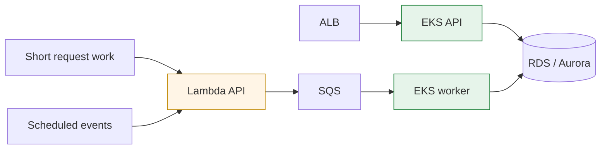

# Moving the Runtime Boundary

**Scope** · Django/FastAPI APIs, scheduled work, queue consumers, native libraries, and large exports  
**Owned** · Lambda delivery, EKS migration path, workload IAM, queue boundary, and cutover/rollback

## Context

Serverless was a good starting point for several backends: low idle cost, simple HTTP delivery, and independent scheduled functions. Over time, some workloads acquired properties that no longer fit the original runtime—large exports, long-running reconciliation, native executables, persistent workers, or memory use that was difficult to predict within a request.

The answer was not a wholesale migration. Request-driven APIs that still fit Lambda kept its operational simplicity. Workloads that needed a warm process, more control over architecture, or queue consumption moved behind EKS.

## Problem

**Runtime limits become application behavior.** A large export killed by memory pressure, a native dependency built for the wrong architecture, or a task cut off by execution duration is experienced as a product failure even when the business logic is correct.

**Moving an HTTP service changes its trust boundary.** An API behind an ALB must correctly recover the original HTTPS scheme, health checks, forwarding headers, and client identity. Copying the application into a container is not a migration.

**Automatic deployment can amplify a bad assumption.** A push-triggered serverless deployment is convenient until the same repository has two valid runtimes and cutovers must be deliberate.

## Approach

### 1. Classify workloads by constraint

- short, bursty, request-driven work can remain on Lambda
- long-running or memory-variable work moves to a container
- durable asynchronous work crosses an SQS boundary
- native dependencies get an explicit image architecture and compatibility test

This kept the migration tied to measured constraints rather than platform preference.

### 2. Move the failure boundary, not just the process

Queue consumers use workload-scoped IAM for only the queue operations they need. Large responses are streamed instead of assembled in memory. The application recognizes the proxy's HTTPS headers. Health and readiness checks cover the route the load balancer actually uses.

### 3. Make cutover intentional

Automatic deployment triggers were replaced with an explicit dispatch where two runtimes coexisted. DNS cutover and rollback inputs were stored as separate reviewed artifacts. The old route stayed available until the new path had served real traffic and its logs were inspectable.

## Outcome

- request-driven serverless paths remained simple instead of being migrated for uniformity
- native and memory-heavy workloads gained controlled architecture, resources, and process lifetime on EKS
- queue boundaries made asynchronous failure and retry independent from the initiating request
- rollback was part of the migration package rather than an improvised incident step

## What I would revisit

The hybrid boundary is useful only while both sides earn their operational cost. I would periodically remeasure invocation shape, queue latency, and steady-state resource use; a runtime decision that was correct during migration can become unnecessary complexity later.

---

## 한국어 요약

Lambda에서 시작한 백엔드 중 대용량 export, 장기 실행 작업, 네이티브 실행 파일, 상시 워커처럼 런타임 제약과 맞지 않게 된 부분만 EKS로 옮겼습니다. 짧고 간헐적인 요청까지 일괄 이전하지는 않았습니다.

이전 과정에서는 컨테이너만 추가한 것이 아니라 SQS 경계, workload IAM, 스트리밍 응답, ALB의 HTTPS 전달 헤더, 명시적 배포 트리거, DNS 롤백 절차까지 함께 다뤘습니다.

